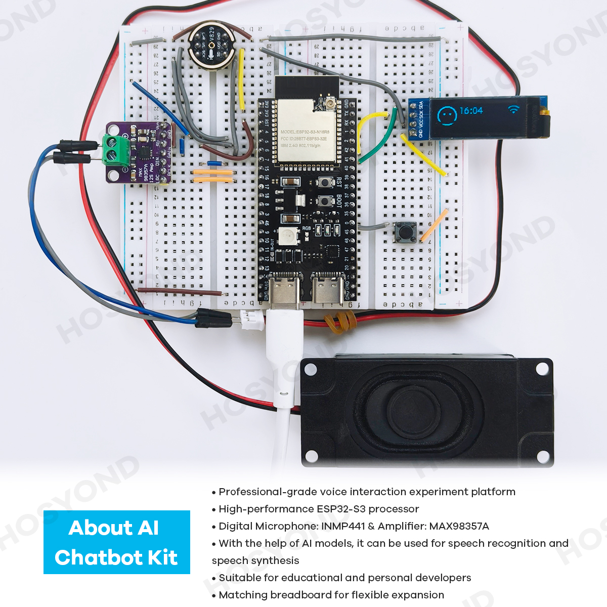

.. _introduction:

Introduction
================

Project Overview
------------------------

The ESP32S3 AI Chatbot is an intelligent voice interaction project based on the ESP32S3 microcontroller. This project integrates hardware modules such as the INMP441 microphone, MAX98357A amplifier and speaker, 128x32(IIC) OLED display, and buttons to create a smart assistant capable of natural language conversation with users.

This project combines edge computing and cloud AI capabilities to provide a smooth voice interaction experience, applicable to various scenarios such as smart home control, personal assistance, educational companionship, entertainment interaction, and more.

This project is based on `xiaozhi-esp32 <https://github.com/78/xiaozhi-esp32/blob/main/README_en.md>`_. If you want to add your own features, you can follow the documentation for secondary development.

Application Scenarios
----------------------

* **Smart Home Assistant**: Control smart devices, check weather, set reminders
* **Learning Companion**: Answer questions, provide learning resources, knowledge Q&A
* **Entertainment Interaction**: Tell stories, play games, offer music recommendations
* **Development Platform**: Test and develop AI applications, voice interaction prototype design
* **IoT Node**: Integrate into larger smart systems as an interactive interface

.. _features:

Key Features
--------------------------------
* **Multiple Wake-up Methods**:
   * Offline voice wake-up (ESP-SR)
   * Physical button wake-up
   * Support for custom wake words

* **Multi-language Support**:
   * English
   * Chinese (Mandarin, Cantonese)
   * Japanese
   * Korean
   * Other languages (Spanish, French, German, etc.)

* **Voice Interaction**:
   * User voice capture via microphone
   * High-quality voice synthesis playback
   * Support for multiple voice timbres
   * Real-time voice dialogue streaming

* **Personalization**:
   * Configurable prompt system
   * Custom character settings
   * Multiple voice timbre options
   * Personalized conversation styles

* **OLED Display**:
   * Real-time device status display
   * Scrolling conversation content
   * System information display

* **Intelligent Dialogue**:
   * Connection to cloud AI large language models
   * Context understanding support
   * Knowledge Q&A and task execution
   * Natural conversational interaction

* **Expandability**:
   * Open hardware and software architecture
   * Support for custom function extensions
   * Rich secondary development interfaces
   * Support for multiple hardware platforms

.. _tech_specs:

Technical Specifications
--------------------------------

* Core Controller: ESP32S3 module
* Voice Input: Microphone module
* Voice Output: Speaker module
* Display Interface: OLED display module
* Interaction Methods: Voice recognition, physical buttons
* Power Supply: USB power
* Connectivity: Wi-Fi, Bluetooth
* Supported Languages: Multi-language support 