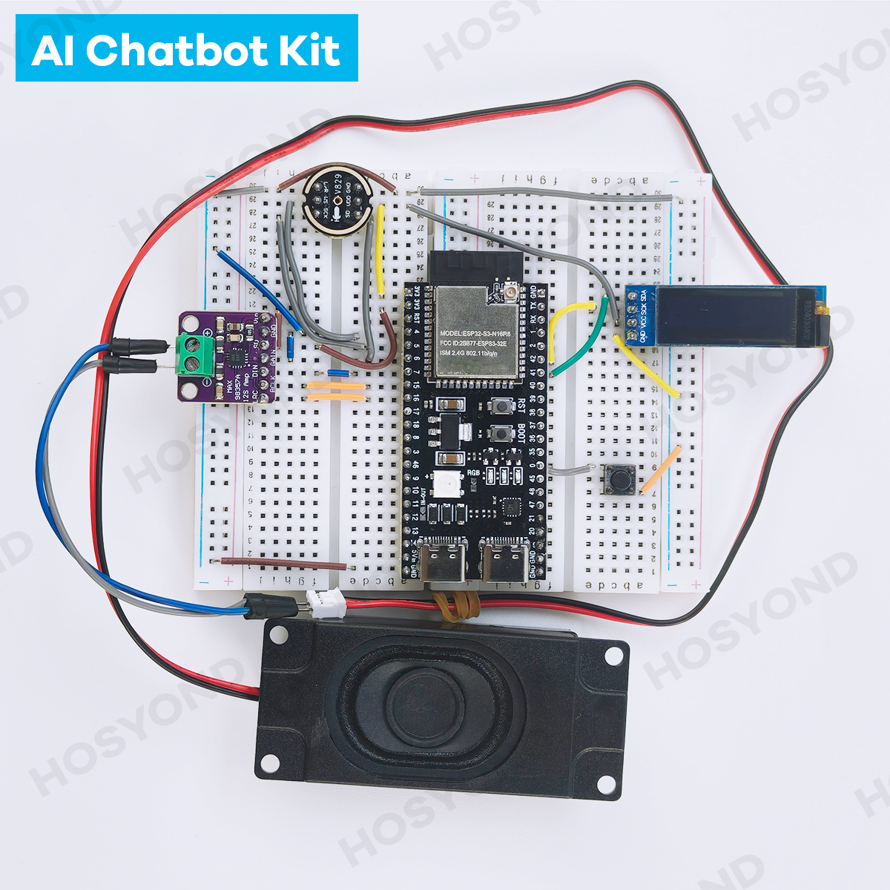

硬件介绍连接
==========

硬件清单
--------

.. list-table::
   :widths: 30 70
   :header-rows: 1

   * - 组件
     - 说明
   * - ESP32S3模块 *1
     - 核心微控制器，负责处理语音识别、AI对话等核心功能
   * - 面包板 *2
     - 用于组装各个硬件模块的基础平台
   * - INMP441麦克风模块 *1
     - 采集用户语音输入
   * - MAX98357A功放&扬声器模块 *1
     - 播放语音回复
   * - OLED IIC屏幕
     - 显示设备状态和对话内容
   * - 按钮
     - 提供物理交互功能，如唤醒设备、重置等
   * - 跳线
     - 连接各个模块
   * - USB数据线
     - 提供电源和数据传输

连接图解
--------

.. figure:: img/connect02.jpg
   :alt: ESP32S3连接图
   :align: center

   ESP32S3与各模块连接示意图

连接完成之后应该如下图所示

   ESP32S3与各模块连接示意图

.. 上面这一段感觉可以删掉,毕竟少了两个按钮,并且走线也不美观

.. warning:: 
  务必按照上面的链接图连接模块,否则可能会导致模块损坏.

连接说明
--------

ESP32S3模块与其他组件的连接方式如下：

**麦克风模块连接**

* VCC - 3.3V
* GND - GND
* WS  - GPIO4
* SCK - GPIO5
* SD  - GPIO6

**功放&扬声器模块连接**

* VCC - 3.3V
* GND - GND
* DIN - GPIO7
* BCLK - GPIO15
* LRC - GPIO16

**OLED显示模块连接**

* VCC - 3.3V
* GND - GND
* SCL - GPIO42
* SDA - GPIO41

**按钮连接**

* 音量+ - GPIO40
* 音量- - GPIO39

组装步骤
--------

1. 将ESP32S3模块插入面包板中央位置
2. 按照上述连接说明，使用跳线连接各个模块
3. 检查所有连接是否牢固，避免虚接
4. 使用USB数据线连接ESP32S3模块的USB端口
